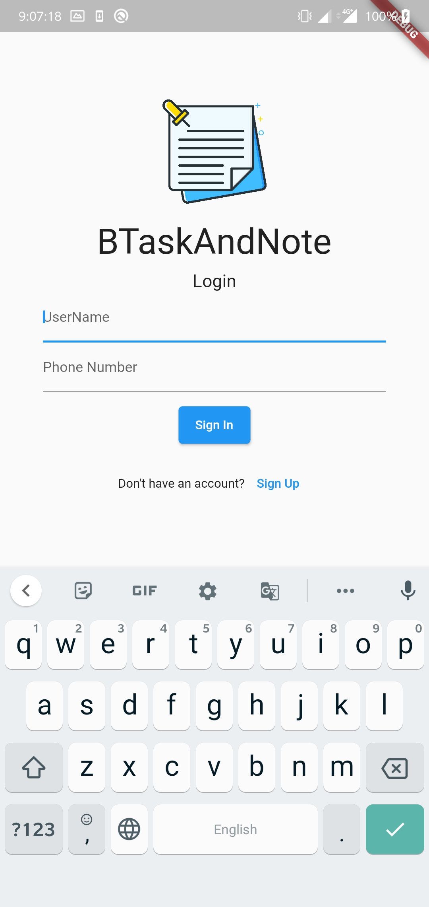
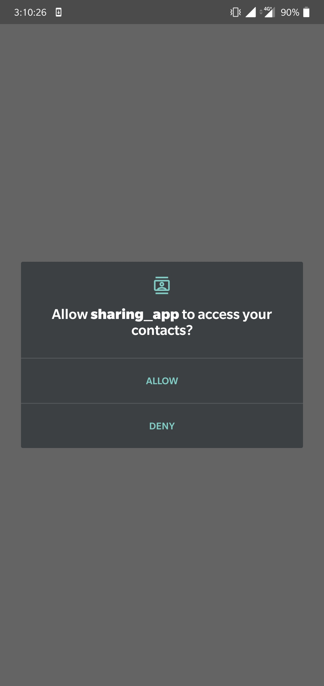
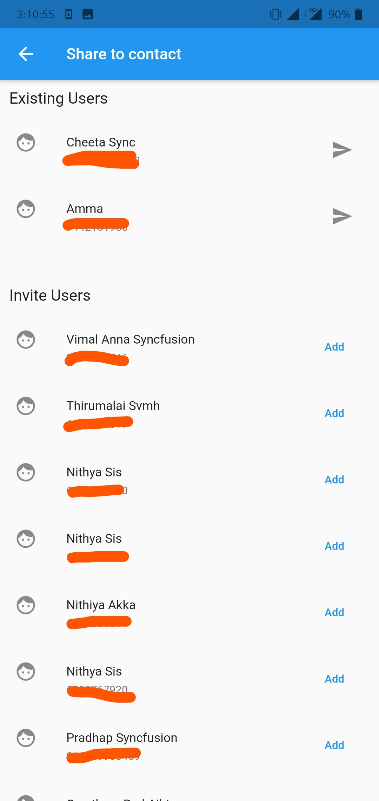
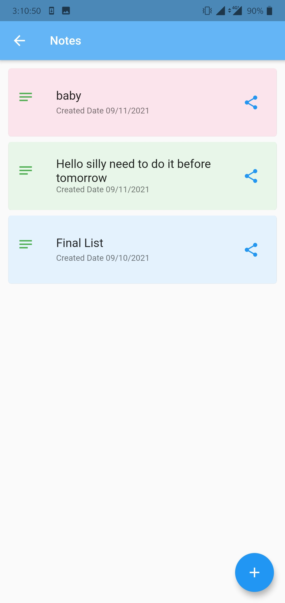
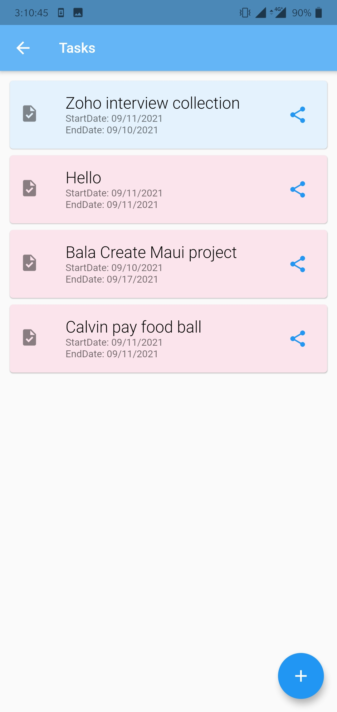
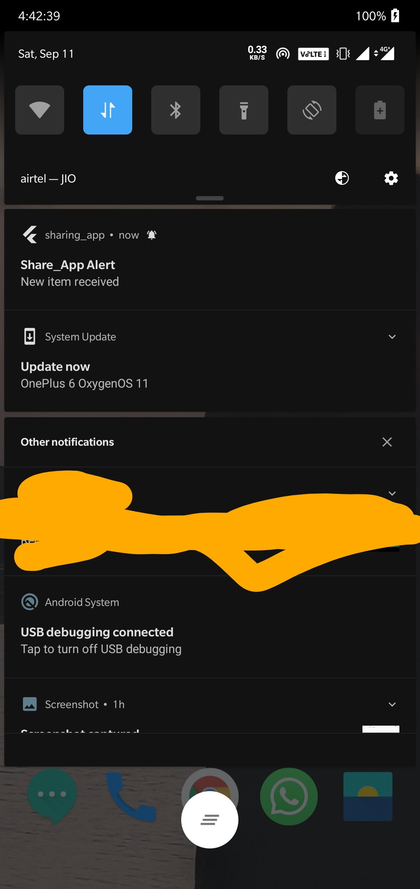
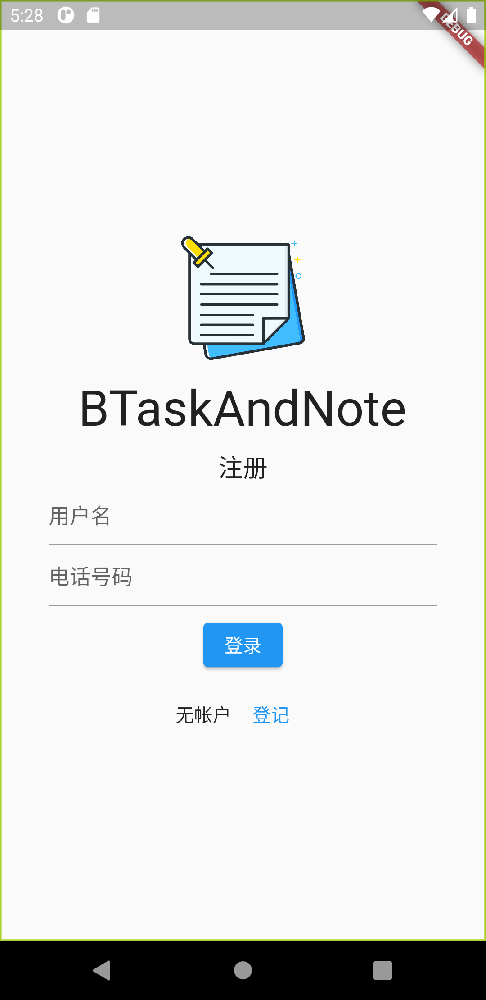
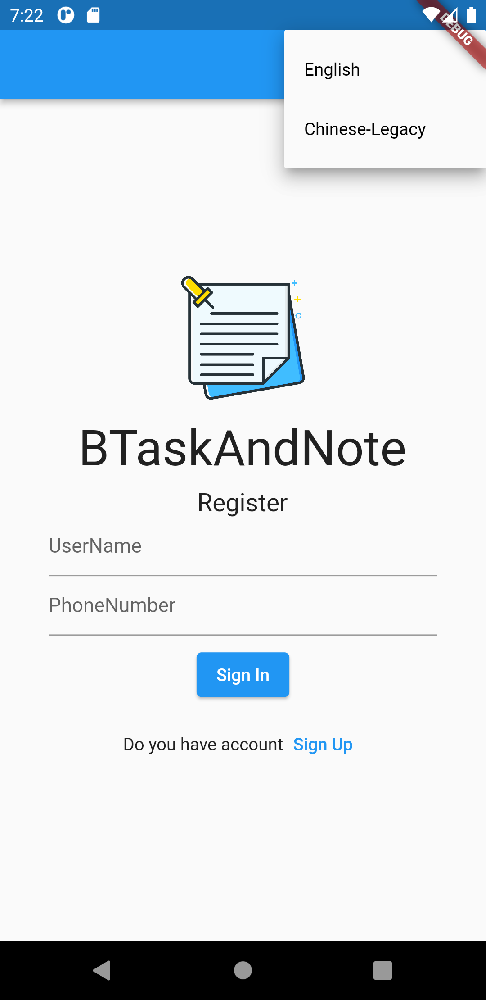

# BSharing_App_For_Notes_And_Tasks

Purpose of app is to create, maintiain task/notes and sharing this same to your colleagues who has the same app.

* Used firebase to maintain the notes/task
* Perform read and write the task/note.
* Integrated the push notification(Cloud Messaging)
* Used Provider
* Fetching contact from base, without 3rd party plugin
* Maintained Sent task/notes
* Maintained Received task/notes
* Auto fill contact number in filled if its exist in phone settings.

Accept the access account permission to fetch contact           |  Auto fetch Contact list
:-------------------------:|:-------------------------:
  |  

Note's View           |  Task's View
:-------------------------:|:-------------------------:
  |  

Home Page           |  Push Notification
:-------------------------:|:-------------------------:
  | 

Localization Support           |  Chinese Language
:-------------------------:|:-------------------------:
  | 
