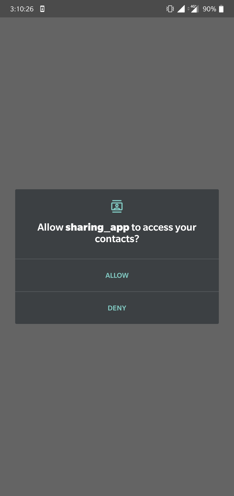
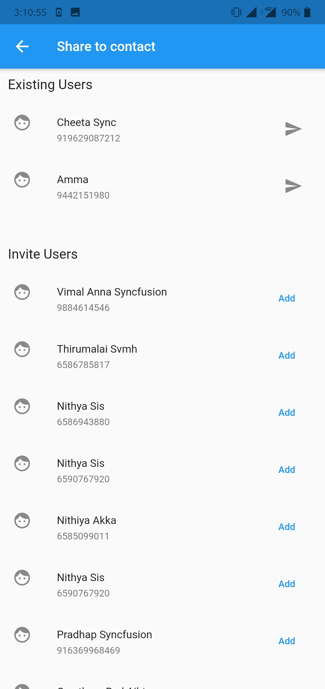
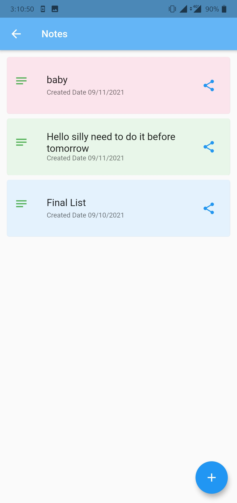
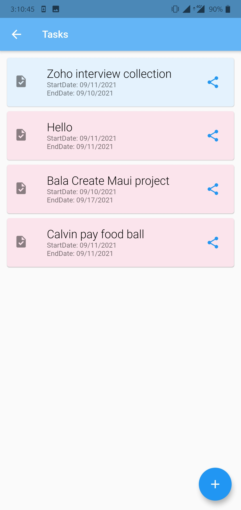
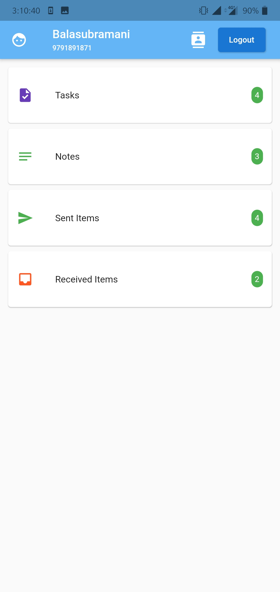

# BSharing_App_For_Notes_And_Task

App will demonstrate the creating task/notes, maintain and share your contact

* Used firebase to maintain the notes/task
* Integrated the push notification(Cloud Messaging)
* Used Provider
* Fetching contact from base, without 3rd party plugin
* Maintained Sent task/notes
* Maintained Received task/notes
* Auto fill contact number in filed if its exist in phone settings.

